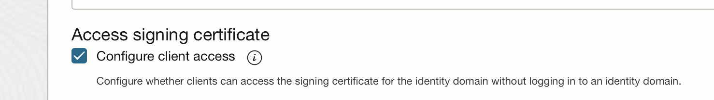

# Test Graal VM
This is a small play around with Oracke GraalVM and the deployment on OCI

# Preperation

* `brew install --cask graalvm-jdk`
* `brew install maven`

# Implemented Features
## 1. spring boot application
* Just an ordanary spring boot application with an simple hello world endpoint [(http://localhost:8080/hello)](http://localhost:8080/hello).
* `./run_plain.sh`
* [(http://localhost:8080/public/hello)](http://localhost:8080/public/hello)

## 2. GraalVM native build
* add native-maven-plugin to pom.xml
* add native profile to pom.xml
* run `./run_native.sh`
* [(http://localhost:8080/hello)](http://localhost:8080/hello)

## 3. Docker deployment
* add mvnw
* add .mvn/wrapper
* `run_docker.sh`
* [(http://localhost:8080/hello)](http://localhost:8080/hello)


## 4. OAuth protection
### Register a client application in OCI
* https://docs.oracle.com/en-us/iaas/Content/Identity/api-getstarted/OATOAuthClientWebApp.htm
* make jwk endpoint public `Identity > Domains > Default domain > Settings > Domain settings` 

### Get your JWT to try your code
```bash
curl -i \
   -H "Authorization: <Basic base 65 encoded clientId:Secret>" \
   -H "Content-Type: application/x-www-form-urlencoded;charset=UTF-8" \
   --request POST https://<domain URL>/oauth2/v1/token \
   -d "grant_type=client_credentials&scope=urn:opc:idm:__myscopes__"
```
### Dependencies
* spring-boot-starter-security
* spring-boot-starter-oauth2-resource-server

### Properties
* Set `issuer-uri: <your domein>/.well-known/openid-configuration`
* Set `issuer-uri: https://identity.oraclecloud.com/`

